# GitHub README Beautify (bespoke authoring)

Produce a consistent, animated, on-brand README for one or many GitHub repos and
push it. The visual centerpiece is a **1280×380 hero banner as a standalone SVG using
SMIL animation** — GitHub strips inline `<style>`/`<script>` but keeps `` and renders its SMIL animations, so the banner moves inside the
README with zero JS.

## 🚫 No preset library — this is the core rule

This skill has **no motif functions, no animation-preset dictionary, no THEMES data
file, and no shared palette presets**. Every banner is **hand-authored from a blank
canvas** for the one repo it belongs to. The only shared tool is the QA validator
(`scripts/validate_banner.py`), which checks correctness and guards against accidental
copying — it never supplies a shape to reuse. Rationale: a preset library makes "change
the color and reuse the SVG" far too easy, and that reads as templated. Ground-up
authoring is the only way to guarantee a portfolio that looks like a *family of distinct
crafts*, not a *template with swapped hues*.

## When to use
- "美化我的 GitHub README / 给每个仓库加动画横幅"
- Standardize the look of several repos at once (through shared *craft*, not shared *parts*)
- Add architecture/flow diagrams and feature tables to a repo landing page

## Prerequisites
- `gh` authenticated (`gh auth status`).
- System Python 3.12 at `/c/Users/lenovo/AppData/Local/Programs/Python/Python312/python.exe`
  (the managed 3.13 writes to an invisible sandbox — see gotchas).
- `git` and network access to GitHub.

## Workflow

### Step 1 — Inventory and scope
List the target repos and **exclude the profile repo** (`OWNER` itself). Inspect each
repo's real tree and default branch before generating, because content may live in a
subdirectory (e.g. `KeLing2.0` → `Desktop/KeLing/`, branch `master`):

```bash
gh api repos/OWNER/REPO/contents/ --jq '.[].name'
gh api repos/OWNER/REPO --jq '.default_branch'
```
Record, per repo: default branch, target path for `README.md` + `banner.svg`
(+ `diagrams/` if a diagram applies).

### Step 1.2 — HARD RULE: design from the FULL README, never from the title
A banner that merely illustrates the repo *name* reads as shallow. Always:
1. **Read the entire README** (and the repo `description` + `topics`). Extract: *what
   the project actually is*, its **core features**, its **tech stack**, and its
   **audience / vibe**.
2. **Synthesize 2–3 visual concepts from the CONTENT** — e.g. ChainPass is *W3C DID +
   verifiable credentials + cross-border payment + KYC compliance + ZKP login*, NOT
   "a chain and a password". Pick the concept that represents the *whole*, not a pun on
   the name.
3. **Write a one-line design rationale** for the chosen motif (so the next run stays
   content-driven). If you catch yourself reaching for the name's literal object, stop
   and re-read the features list.

### Step 1.5 — HARD RULE: every banner is hand-authored, nothing is reused
A beautified portfolio must read as a *family*, not a *template*. Enforce:

1. **Author each banner from scratch.** Open a blank 1280×380 SVG and draw the repo's
   hero object as raw shapes (`path`/`circle`/`rect`/`polygon`). Do NOT copy a shape,
   path `d`, or motif group from another banner — including the ones in `banners/`.
   Those shipped files are *delivered one-off artifacts / the uniqueness baseline*, not
   components to import.
2. **Distinct hue family per repo.** Pick a fresh background gradient + accent for this
   repo; it must not coincide with a sibling's hue. Check `banners/` first.
3. **One signature object + TWO MANDATORY motion layers** (see Step 2). Not a generic
   "document" or "gear" — something that says *this* project, with motion that (a) runs
   across the **whole** banner and (b) lives **around the title text**.
4. **Mascot / core-concept visual language (user mandate)** — the banner centers on a
   **lively, animated mascot or core-concept object**, not a static logo: **bold strokes**
   (`stroke-width` 6–12); **rich multi-color palette (≥ 3 colors)** — vibrant multi-stop
   gradient + 2–3 accents, colorful and diverse, no monochrome; **one focal mascot only**
   that MOVES (bob/float/rotate/swing, nested in an inner `<g>`), in open space with
   generous negative space; **NO circular badge frame**; **no element stacking** (don't
   pile coins/satellites/cards/arrows). Full细则见 `references/principles.md` → "Mascot /
   core-concept visual language".
5. **The automated guards are the folder uniqueness check (Rule 6) and the motion-layer
   check (Rule 7)** in `validate_banner.py`. They compare a candidate banner against
   every file in `banners/` (Rule 6) and verify both motion layers exist (Rule 7).
   **Do not push a banner that fails either.**
5. **No preset files exist to lean on.** If you feel tempted to "reuse a motif and just
   change the color," that is exactly the anti-pattern this skill forbids — draw a new
   object instead.

### Step 2 — Author the bespoke banner
Follow `references/principles.md` (canvas anatomy, authoring process, DO/DON'T,
accessibility). In short:

1. From your Step 1.2 synthesis, pick **one** signature object unique to the repo's
   *content* — never the name.
2. Sketch it as raw SVG shapes, centered on a `translate(cx,cy)` anchor with
   `cx in [760,1200]`. Keep every shape's local coord within ±260 of that anchor.
3. Give the hero object **one** purposeful animation (draw-on, pulse, sweep, bob,
   rotate) — pure SMIL. Never put `rotate`/`scale` `<animateTransform>` on the SAME
   `<g>` that carries the `translate()` base (it wipes positioning — Rule 3).
4. **Add the TWO mandatory motion layers** (these are required on *every* banner):
   - **(a) Banner-wide motion** — an animation that exists across the *entire* 1280px
     width: a light beam sweeping left→right, a particle field drifting across, or a
     gradient wash. Its travel/extent must span ≥ 600px horizontally (Rule 7 detects
     this). Purpose: unify the canvas and give the whole banner life.
   - **(b) Title-surround motion** — animation localized *around the title text* (left
     zone, x ≤ 700): an orbiting accent dot, a pulsing halo behind the title, an
     underline that draws in, particles rising from the letters. Rule 7 detects any
     animated element whose anchor sits in the title window.
5. Choose a fresh palette; compose the left column (gradient title, muted subtitle,
   0–3 tag pills, optional frosted panel).
6. Save as `banner.svg`. A shipped example is in `assets/sample-banner.svg`.

```bash
# after authoring banner.svg for repo X:
python scripts/validate_banner.py banner.svg                 # Rule 1-4 on the file
python scripts/validate_banner.py --motion banner.svg        # Rule 7 (two motion layers)
python scripts/validate_banner.py --gate banners/ banner.svg # Rule 1-4 + 6 + 7 before push
```

### Step 3 — Generate architecture / flow diagrams (optional but recommended)
For technical repos, add a function to the `DIAGRAMS` dict in `scripts/gen_diagrams.py`
(start from a shipped template) and run:

```bash
python scripts/gen_diagrams.py RepoKey > diagrams/RepoKey.svg
```
(Diagrams are a separate deliverable from the hero banner; this helper is fine to use.)

### Step 4 — Build the enhanced README
Add a builder to `BUILDERS` in `scripts/gen_readmes.py`. Each builder composes
`banner_img()` + `badge_row()` + `feature_table()` and re-embeds the **original**
README body (its first `# Title` is stripped to avoid duplication). Place original
READMEs as `<BASE>/<RepoName>.md` (`BASE` = cwd, or set `README_BASE`):

```bash
python scripts/gen_readmes.py RepoName > README.md
```

### Step 4.5 — QA validate (run before every push)
A broken banner ships **silently**. The classic defect: an animation that *wipes* the
motif's positioning transform — e.g. a `rotate`/`scale` `<animateTransform>` placed on
the **same** `<g>` as its `translate` base (you see only a stray dot). The static
validator needs **no renderer**:

```bash
python scripts/validate_banner.py banner.svg              # Rule 1-4 on one file
python scripts/validate_banner.py --motion banner.svg     # Rule 7: two mandatory motion layers
python scripts/validate_banner.py --badges README.md      # Rule 5 badge safety
python scripts/validate_banner.py --check-unique banners/ [new.svg]  # Rule 6 uniqueness
python scripts/validate_banner.py --gate banners/ [new.svg]          # Rule 1-4 + 6 + 7 (pre-push gate)
python scripts/validate_banner.py --all banners/          # Rule 1-4 on each + Rule 6 across set
```
Rule 6 (uniqueness) compares every banner in the given folder (plus any extra file you
pass) against every other: it FAILS on a recolor-clone (structurally identical after
stripping colors) **or** on a shared hero-motif shape. Exit code is non-zero on any
collision. **All banners must PASS before you push.**

Rule 7 (motion layers) is the guard for *new* banners: it FAILS a banner that lacks
either the **banner-wide** motion (an animation spanning ≥ 600px horizontally) or the
**title-surround** motion (an animated element in the title window, x ≤ 700). Run it via
`--motion <file>` or the combined `--gate <folder> <newfile>`. **Note:** `--all` checks
Rule 1-4 + Rule 6 only (legacy baseline banners predate Rule 7); use `--gate` for any
banner you author under the new rules.

### Step 5 — Push
Prefer the git-clone-then-commit method (robust for multiple files; avoids API
path/sandbox issues). See `references/verification.md` for the exact commands and the
note about subdirectory repos. If `git clone` returns HTTP 403 "repository is
disabled" / "Repository has been locked", **stop** — the repo is locked (the `disabled`
API flag lies). Keep assets local and push after the lock is lifted.

### Step 6 — Verify remotely
Confirm the **remote** banner still contains SMIL (GitHub keeps it, but verify) and
that the README references it:

```bash
gh api repos/OWNER/REPO/contents/banner.svg --jq '.content' \
  | /c/Users/lenovo/AppData/Local/Programs/Python/Python312/python.exe \
      -c "import base64,sys; print(base64.b64decode(sys.stdin.read()).decode())" \
  | grep -c -E '<animate|<animateTransform|<animateMotion'
```
Expect a positive count. Details in `references/verification.md`.

## Critical environment rules (read before executing)
All are in `references/environment-gotchas.md`. The most common failures:
1. **Git Bash has no `base64`** → decode with system Python (pattern above).
2. **Managed Python 3.13 writes to an invisible sandbox** → use system Python 3.12 and
   the "Python stdout → Bash `>` redirect" pattern.
3. **Never pass `/c/...` to Windows Python `open()`** (FileNotFoundError).
4. **Avoid `rm -rf`** (sandbox safe-delete fails) — clone to a fresh dir name instead.
5. **GitHub keeps SMIL in `` but strips inline `<style>`/`<script>`** —
   always commit a separate `banner.svg`, never inline it.
6. **`gh api .disabled` is unreliable** — a real write attempt is the only truth for locks.

## References
- `references/principles.md` — **bespoke banner design principles** (anatomy, authoring
  process, DO/DON'T, accessibility). The primary authoring guide; contains NO preset
  tables to copy from.
- `references/environment-gotchas.md` — Windows/Git Bash/GitHub pitfalls, with commands.
- `references/verification.md` — validate SVG, confirm remote SMIL, push commands, QA render.

## Scripts
- `scripts/validate_banner.py` — static QA: Rule 1-4 (XML/viewBox/transform-wipe/motif
  bounds) + Rule 5 (badge safety) + **Rule 6 (uniqueness vs the `banners/` baseline,
  no recolor-clone / no reused motif shape)** + **Rule 7 (motion layers: every new
  banner must have a banner-wide sweep AND a title-surround animation)** — without a
  renderer.
- `scripts/gen_readmes.py` — enhanced README builder (data-driven via BUILDERS).
- `scripts/gen_diagrams.py` — static architecture/flow SVG diagrams (data-driven via DIAGRAMS; separate artifact from the hero banner).
- `scripts/render_qa.js` — optional static-frame PNG render via `@resvg/resvg-js` (layout QA only; no SMIL).

## Success criteria
- Every targeted repo's README opens with an animated, **hand-authored** `banner.svg`
  (no two banners share a motif shape or are recolor-clones).
- **Every new banner carries the two mandatory motion layers**: a banner-wide sweep
  (≥ 600px horizontal travel) and a title-surround animation — confirmed by
  `validate_banner.py --motion banner.svg` / `--gate`.
- **Design is content-driven**: the motif was chosen from the full README's features,
  not from a pun on the repo name (documented as a one-line rationale).
- Technical repos include a `diagrams/*.svg` reference where applicable.
- Remote `banner.svg` retains SMIL animation tags (verified in Step 6).
- Portfolio reads as a *family of distinct crafts* (shared canvas anatomy + per-repo
  object/palette/motion), never as a recolored template set.
- `python scripts/validate_banner.py --gate banners/ banner.svg` reports PASS (Rule 1-4
  + 6 + 7) before any push of a newly authored banner.
